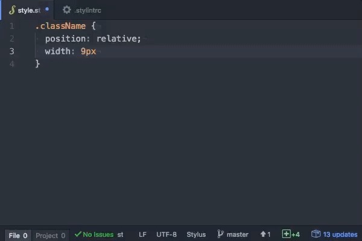

**Atom Stylus Supremacy** is an atom extension for [stylus-supremacy](https://github.com/ThisIsManta/stylus-supremacy) package which helps you fix stylus files with respective `.stylintrc` file.

# Please visit **[our official website](https://thisismanta.github.io/stylus-supremacy)** for features and settings.

## Settings
- Format on save: Let this package fix your stylus file on save.

Related links
- [Stylus language](http://stylus-lang.com)
- [Stylus (Node.js module)](https://www.npmjs.com/package/stylus)
- [Stylus (Visual Studio Code extension)](https://marketplace.visualstudio.com/items?itemName=sysoev.language-stylus)
- [Stylint (Node.js module)](https://www.npmjs.com/package/stylint)
- [Stylint (Visual Studio Code extension)](https://marketplace.visualstudio.com/items?itemName=vtfn.stylint)
- [Stylus Supremacy (Node.js module)](https://www.npmjs.com/package/stylus-supremacy)
